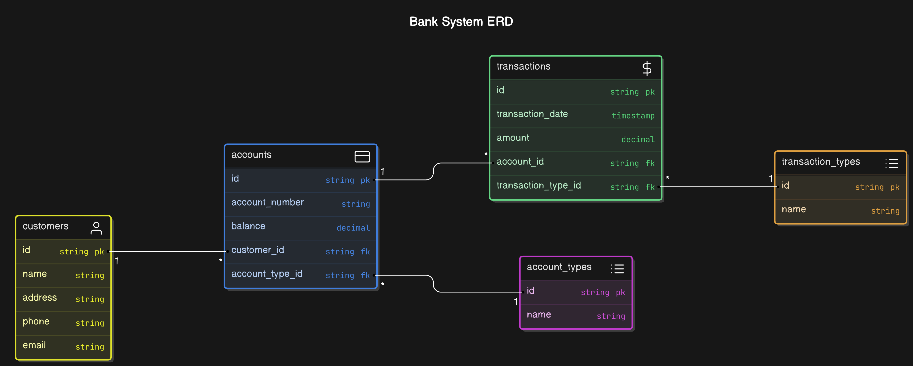

# Bank Management System Design

## Deskripsi

Sistem Manajemen Bank ini dirancang untuk melacak informasi nasabah, akun, dan transaksi mereka. Basis data ini menggunakan Postgre-SQL dengan UUID sebagai primary key untuk memastikan keunikan dan efisiensi dalam pengelolaan data. Dokumentasi ini mencakup desain basis data dan query SQL yang digunakan.

## Desain Basis Data

### Entity-Relationship Diagram (ERD)



#### Entitas

1.  **`customers`**
    - **id**: UUID unik untuk setiap nasabah (Primary Key).
    - **name**: Nama nasabah.
    - **address**: Alamat nasabah.
    - **phone**: Nomor telepon nasabah.
    - **email**: Alamat email nasabah.
2.  **`account_types`**
    - **id**: UUID unik untuk setiap jenis akun (Primary Key).
    - **name**: Nama jenis akun (misalnya, 'Savings').
3.  **`accounts`**
    - **id**: UUID unik untuk setiap akun (Primary Key).
    - **account_number**: Nomor akun yang unik.
    - **balance**: Saldo akun.
    - **customer_id**: UUID yang merujuk ke `customers` (Foreign Key).
    - **account_type_id**: UUID yang merujuk ke `account_types` (Foreign Key).
4.  **`transaction_types`**
    - **id**: UUID unik untuk setiap jenis transaksi (Primary Key).
    - **name**: Nama jenis transaksi (misalnya, 'Deposit').
5.  **`transactions`**
    - **id**: UUID unik untuk setiap transaksi (Primary Key).
    - **transaction_date**: Tanggal dan waktu transaksi.
    - **amount**: Jumlah uang dalam transaksi.
    - **account_id**: UUID yang merujuk ke `accounts` (Foreign Key).
    - **transaction_type_id**: UUID yang merujuk ke `transaction_types` (Foreign Key).

#### Relasi

- **`customers`** ke **`accounts`**: **One-to-Many** (Satu nasabah dapat memiliki banyak akun).
- **`accounts`** ke **`transactions`**: **One-to-Many** (Satu akun dapat memiliki banyak transaksi).
- **`account_types`** ke **`accounts`**: **One-to-Many** (Satu jenis akun dapat memiliki banyak akun).
- **`transaction_types`** ke **`transactions`**: **One-to-Many** (Satu jenis transaksi dapat memiliki banyak transaksi).

## Query PostgreSQL

### Mendefinisikan Tabel

#### customers

```
create table customers (
  id uuid primary key default uuid_generate_v4(),
  name varchar(100),
  address text,
  phone varchar(20),
  email varchar(100)
);
```

#### account_types

```
create table account_types (
  id uuid primary key default uuid_generate_v4(),
  name varchar(50)
);
```

#### accounts

```
create table accounts (
  id uuid primary key default uuid_generate_v4(),
  account_number varchar(20) unique,
  balance numeric(15, 2),
  customer_id uuid,
  account_type_id uuid,
  foreign key (customer_id) references customers(id) on delete cascade,
  foreign key (account_type_id) references account_types(id) on delete cascade
);
```

#### transaction_types

```
create table transaction_types (
  id uuid primary key default uuid_generate_v4(),
  name varchar(50)
);
```

#### transactions

```
create table transactions (
  id uuid primary key default uuid_generate_v4(),
  transaction_date timestamp,
  amount numeric(15, 2),
  account_id uuid,
  transaction_type_id uuid,
  foreign key (account_id) references accounts(id) on delete cascade,
  foreign key (transaction_type_id) references transaction_types(id) on delete cascade
);
```

### Operasi CRUD

#### Menambahkan Data

```
insert into customers (id, name, address, phone, email)
values
  (
    '4fe4c464-0fe1-4b86-97f4-884809068024',
    'John Doe', '123 Elm Street', '123-456-7890',
    'john.doe@example.com'
  );
```

```
insert into account_types (id, name)
values
  (
    '9362185c-a762-4cdc-a8e8-efca6d0c9882',
    'Savings'
  );
```

```
insert into accounts (
  id, account_number, balance, customer_id,
  account_type_id
)
values
  (
    '4ec3638c-06f4-43b7-b3dd-42e20749d58b',
    'ACC123456', 1000.00, '4fe4c464-0fe1-4b86-97f4-884809068024',
    '9362185c-a762-4cdc-a8e8-efca6d0c9882'
  );
```

```
insert into transaction_types (id, name)
values
  (
    '54af0699-ff09-423f-a777-6c3feb41a0c2',
    'Deposit'
  );
```

```
insert into transactions (
  id, transaction_date, amount, account_id,
  transaction_type_id
)
values
  (
    '75c9d151-54ae-4ac9-9431-54b7dee681be',
    '2024-08-01 10:00:00', 500.00, '4ec3638c-06f4-43b7-b3dd-42e20749d58b',
    '54af0699-ff09-423f-a777-6c3feb41a0c2'
  );
```

#### Membaca Data

```
select
  *
from
  customers;
```

```
select
  *
from
  accounts a
where
  customer_id = '4fe4c464-0fe1-4b86-97f4-884809068024';
```

```
select
  *
from
  transactions t
where
  account_id = '4ec3638c-06f4-43b7-b3dd-42e20749d58b';
```

#### Memperbarui Data

```
update
  accounts
set
  balance = 1200.00
where
  id = '4ec3638c-06f4-43b7-b3dd-42e20749d58b';
```

```
update
  customers
set
  email = 'john.newemail@example.com'
where
  id = '4fe4c464-0fe1-4b86-97f4-884809068024';
```

#### Menghapus Data

```
-- Delete account
delete from
  accounts
where
  id = '4ec3638c-06f4-43b7-b3dd-42e20749d58b';
```

```
-- Delete customer
delete from
  customers
where
  id = '4fe4c464-0fe1-4b86-97f4-884809068024';
```

## Kontribusi

Jika Anda memiliki saran atau perbaikan untuk aplikasi ini, silakan buat pull request atau buka issue di repositori ini.

## Lisensi

Proyek ini menggunakan lisensi MIT. Lihat file `LICENSE` untuk informasi lebih lanjut.

---
